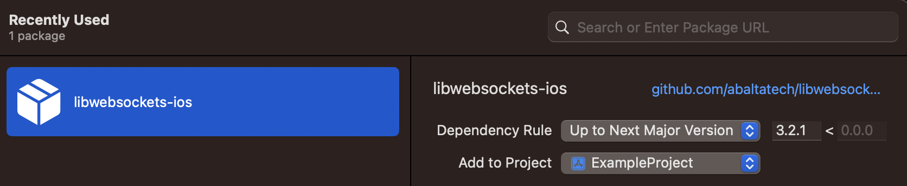

# libwebsockets-ios

This is a swift package that exposes libwebsockets.xcframework built from the [libwebsockets](https://github.com/warmcat/libwebsockets) github repository. This simplifies the process of importing the prebuilt libwebsockets.xcframework into your project, eliminating the need for manual building.

# Table of Contents
- [Installation](#installation)
  - [Swift Package Manager](#swift-package-manager)
  - [Xcode](#xcode)
- [Documentation](#documentation)
- [License](#license)
- [Usage](#usage)
## Installation

To use `libwebsockets` in your own project, you can use:   
### Swift Package Manager

```swift
// swift-tools-version:5.6
import PackageDescription

let package = Package(
  name: "MyPackage",
  dependencies: [
    .package(
      url: "https://github.com/abaltatech/libwebsockets-ios.git", 
      .upToNextMajor(from: "3.2.1") // or `.upToNextMinor
    )
  ],
  targets: [
    .target(
      name: "MyTarget",
      dependencies: [
        .product(name: "Libwebsockets", package: "libwebsockets-ios")
      ]
    )
  ]
)
```

### Xcode
Add https://github.com/abaltatech/libwebsockets-ios.git to your package dependencies 
  

## Documentation
You can view the api reference docs at https://libwebsockets.org/lws-api-doc-main/html/index.html  
For more information you can visit the [libwebsockets](https://github.com/warmcat/libwebsockets) repository

## License

This package uses the same license as the official [libwebsockets](https://github.com/warmcat/libwebsockets/blob/main/LICENSE) library. The license can be found in the [`LICENSE.md`](LICENSE.md) file.

## Usage
Include the c++ headers
```c++
#include <libwebsockets/libwebsockets.h>
```

